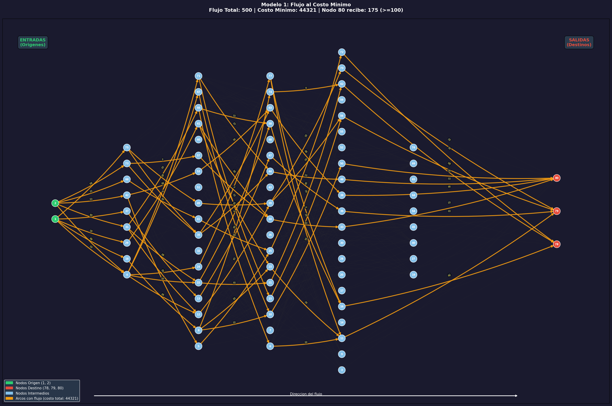

# Tarea 1: Modelos de Optimizacion de Redes

## Descripcion General

Este proyecto implementa tres modelos de optimizacion sobre un **grafo dirigido de 80 nodos y 391 arcos**, representando una red de transporte. Los datos provienen del archivo `data/matriz_de_datos.csv`.

### Metodologias Utilizadas
Cada modelo ha sido implementado bajo dos enfoques complementarios:
1.  **Metodologia Algoritmica (NetworkX / NX)**: Basada en algoritmos clasicos de teoria de grafos (Dijkstra, Edmonds-Karp).
2.  **Metodologia de Programacion Matematica (PuLP)**: Basada en modelos de optimizacion lineal resueltos con el solver CBC.

| # | Modelo | Enfoque Algoritmico (NX) | Enfoque Matematico (PuLP) | Otros Enfoques |
|---|---|---|---|---|
| 1 | Flujo al Costo Minimo | Caminos mas cortos sucesivos | Programacion Lineal | - |
| 2 | Flujo Maximo | Preflow-Push (Default) | Maximizacion de Flujo Neto | **Ford-Fulkerson (DFS)** |
| 3 | Ruta Mas Corta | Dijkstra | Programacion Lineal Binaria | - |

---

## Estructura del Proyecto

```
Tarea1/
├── README.md                              <- Este archivo
├── data/
│   └── matriz_de_datos.csv                <- Datos del grafo (391 arcos)
├── doc/
│   └── Tarea 1 - 2026.pdf                 <- Enunciado de la tarea
├── src/
│   ├── modelo1_flujo_costo_minimo/
│   │   └── flujo_costo_minimo.py          <- Script del modelo 1 (NetworkX)
│   ├── modelo1_flujo_costo_minimo_pulp/
│   │   └── flujo_costo_minimo_pulp.py     <- Script del modelo 1 (PuLP)
│   ├── modelo2_flujo_maximo/
│   │   └── flujo_maximo.py                <- Script del modelo 2 (NetworkX)
│   ├── modelo2_flujo_maximo_pulp/
│   │   └── flujo_maximo_pulp.py           <- Script del modelo 2 (PuLP)
│   ├── modelo2_flujo_maximo_ff/
│   │   └── flujo_maximo_ff.py             <- Script del modelo 2 (Ford-Fulkerson DFS)
│   ├── modelo3_ruta_mas_corta/
│   │   └── ruta_mas_corta.py              <- Script del modelo 3 (NetworkX)
│   └── modelo3_ruta_mas_corta_pulp/
│       └── ruta_mas_corta_pulp.py         <- Script del modelo 3 (PuLP)
└── output/
    ├── modelo1/                           <- Resultados NetworkX M1
    ├── modelo1_pulp/                      <- Resultados PuLP M1
    ├── modelo2/                           <- Resultados NetworkX M2
    ├── modelo2_pulp/                      <- Resultados PuLP M2
    ├── modelo2_ff/                        <- Resultados Ford-Fulkerson M2
    ├── modelo3/                           <- Resultados NetworkX M3
    └── modelo3_pulp/                      <- Resultados PuLP M3
```

---

## Datos de Entrada

El archivo `data/matriz_de_datos.csv` contiene la definicion completa del grafo:

| Columna | Descripcion |
|---|---|
| `Origen` | Nodo de inicio del arco |
| `Destino` | Nodo de fin del arco |
| `Costo` | Costo unitario de transporte |
| `Distancia` | Distancia fisica del arco |
| `Capacidad` | Capacidad maxima de flujo del arco |

### Nodos clave

- **Nodos origen (fuentes):** 1, 2
- **Nodos destino (sumideros):** 78, 79, 80
- **Nodos intermedios:** 3–77 (los que aparecen en la red)

---

## Modelo 1: Flujo al Costo Minimo

**Archivo:** `src/modelo1_flujo_costo_minimo/flujo_costo_minimo.py`

### Problema
Transportar **500 unidades** desde los nodos origen (1, 2) hacia los nodos destino (78, 79, 80), **minimizando el costo total** de transporte. Restriccion adicional: al menos el **20% (100 unidades)** debe llegar al nodo 80.

### Algoritmo
`nx.min_cost_flow()` — Implementacion del algoritmo de **caminos mas cortos sucesivos** (Successive Shortest Path Algorithm).

### Modelado
1. Se crea un **super-origen** (nodo 0) conectado a los nodos 1 y 2 con costo 0.
2. Se crea un **super-destino** (nodo 81) que recibe flujo de 78, 79 y 80.
3. Se crea un **nodo auxiliar** (nodo 82) para forzar que al menos 100 unidades pasen por el nodo 80.
4. Se asignan demandas: -500 en el super-origen, +500 en el super-destino.

### Funciones del script

| Funcion | Descripcion |
|---|---|
| `cargar_datos()` | Lee el CSV y retorna un DataFrame |
| `construir_grafo()` | Crea DiGraph con capacity, weight, distance |
| `agregar_super_nodos()` | Agrega nodos 0, 81, 82 y configura demandas |
| `resolver_flujo()` | Ejecuta min_cost_flow() y retorna solucion |
| `analizar_resultados()` | Extrae metricas: flujo por destino, arcos activos |
| `calcular_layout()` | Posiciones jerarquicas (origenes izq, destinos der) |
| `generar_grafica()` | PNG con arcos activos resaltados y etiquetas |
| `generar_readme()` | README.md con resultados detallados |

### Resultados

| Metrica | Valor |
|---|---|
| **Costo total minimo** | **44,321** |
| Flujo al nodo 78 | 131 (26.2%) |
| Flujo al nodo 79 | 194 (38.8%) |
| Flujo al nodo 80 | 175 (35.0%) >= 100 ✅ |
| Arcos activos | 77 |
| Tiempo de ejecucion | ~0.008 seg |



> Resultados detallados en `output/modelo1/README.md`

---

## Modelo 2: Flujo Maximo

**Archivo:** `src/modelo2_flujo_maximo/flujo_maximo.py`

### Problema
Determinar el **flujo maximo** que puede transportarse desde los nodos origen (1, 2) hacia los nodos destino (78, 79, 80), respetando las capacidades de cada arco.

### Algoritmo
`nx.maximum_flow()` — Implementacion del algoritmo de **Edmonds-Karp** (variante de Ford-Fulkerson con BFS para encontrar caminos aumentantes).

### Modelado
1. Se crea un **super-origen** (nodo 0) conectado a 1 y 2 con capacidad infinita (10,000).
2. Se crea un **super-destino** (nodo 81) conectado desde 78, 79 y 80 con capacidad infinita.
3. El flujo maximo se calcula entre el super-origen y el super-destino.

### Funciones del script

| Funcion | Descripcion |
|---|---|
| `cargar_datos()` | Lee el CSV y retorna un DataFrame |
| `construir_grafo()` | Crea DiGraph con capacity, cost, distance |
| `agregar_super_nodos()` | Agrega nodos 0 y 81 con cap. infinita |
| `resolver_flujo_maximo()` | Ejecuta maximum_flow() (Edmonds-Karp) |
| `analizar_resultados()` | Extrae metricas y cuellos de botella |
| `calcular_layout()` | Posiciones jerarquicas (origenes izq, destinos der) |
| `generar_grafica()` | PNG con grosor de arcos proporcional al flujo |
| `generar_readme()` | README.md con resultados detallados |

### Resultados

| Metrica | Valor |
|---|---|
| **Flujo maximo total** | **532** |
| Flujo al nodo 78 | 164 (30.8%) |
| Flujo al nodo 79 | 77 (14.5%) |
| Flujo al nodo 80 | 291 (54.7%) |
| Arcos activos | 73 |
| Arcos saturados | 29 |
| Tiempo de ejecucion | ~0.005 seg |


> Resultados detallados en `output/modelo2/README.md`

---

## Modelo 3: Ruta Mas Corta

**Archivo:** `src/modelo3_ruta_mas_corta/ruta_mas_corta.py`

### Problema
Encontrar la **ruta mas corta** (en distancia) entre los nodos origen (1, 2) y los nodos destino (78, 79, 80). Se evaluan las **6 combinaciones** posibles.

### Algoritmo
`nx.shortest_path()` con `nx.shortest_path_length()` — Implementacion del **algoritmo de Dijkstra** para grafos con pesos no negativos. Complejidad: O((V + E) log V).

### Funciones del script

| Funcion | Descripcion |
|---|---|
| `cargar_datos()` | Lee el CSV y retorna un DataFrame |
| `construir_grafo()` | Crea DiGraph con weight=Distancia |
| `calcular_todas_rutas()` | Dijkstra para cada par (origen, destino) |
| `identificar_mejor_ruta()` | Selecciona la ruta con menor distancia |
| `obtener_detalle_arcos()` | Atributos de cada arco de una ruta |
| `calcular_layout()` | Posiciones jerarquicas (origenes izq, destinos der) |
| `generar_grafica_todas()` | PNG con las 6 rutas en colores diferentes |
| `generar_grafica_mejor()` | PNG enfocado en la mejor ruta |
| `generar_readme()` | README.md con resultados detallados |

### Resultados

| # | Origen → Destino | Distancia | Ruta |
|---|---|---|---|
| 1 | **1 → 80** | **172** ⭐ | 1 → 29 → 41 → 6 → 14 → 80 |
| 2 | 1 → 78 | 204 | 1 → 29 → 61 → 25 → 72 → 78 |
| 3 | 2 → 80 | 210 | 2 → 42 → 35 → 7 → 14 → 80 |
| 4 | 2 → 79 | 218 | 2 → 42 → 8 → 10 → 9 → 79 |
| 5 | 1 → 79 | 220 | 1 → 29 → 61 → 10 → 9 → 79 |
| 6 | 2 → 78 | 226 | 2 → 42 → 8 → 10 → 72 → 78 |

**Ruta mas corta global:** Nodo 1 → Nodo 80, distancia **172**, por 5 arcos.

| Tiempo de ejecucion | ~0.004 seg |
|---|---|


> Resultados detallados en `output/modelo3/README.md`

---

## Variantes con PuLP

Se han implementado variantes de cada modelo utilizando la libreria **PuLP** para modelado de programacion lineal (LP). Esto permite comparar el rendimiento y la flexibilidad de los algoritmos especializados de NetworkX frente a un solver generalista (CBC).

| Variante | Carpeta Script | Carpeta Output |
|---|---|---|
| M1 (PuLP) | `src/modelo1_flujo_costo_minimo_pulp/` | `output/modelo1_pulp/` |
| M2 (PuLP) | `src/modelo2_flujo_maximo_pulp/` | `output/modelo2_pulp/` |
| M3 (PuLP) | `src/modelo3_ruta_mas_corta_pulp/` | `output/modelo3_pulp/` |

### Comparacion de Resultados
Ambos enfoques (NetworkX y PuLP) llegan a los mismos valores optimos:
- **Modelo 1:** Costo total 44,321
- **Modelo 2:** Flujo maximo 532
- **Modelo 3:** Ruta mas corta 172

---

## Visualizacion de Grafos

Todas las graficas comparten la misma disposicion jerarquica:

- **Izquierda:** Nodos origen (entradas) en **verde**
- **Centro:** Nodos intermedios en **azul claro**, distribuidos por capas segun profundidad BFS
- **Derecha:** Nodos destino (salidas) en **rojo**
- Flecha de direccion del flujo de izquierda a derecha
- Fondo oscuro estilo dark mode

Los arcos activos (con flujo > 0 o parte de una ruta) se resaltan en **naranja/amarillo** con etiquetas de valor.

---

## Requisitos

### Dependencias

```
pip install networkx matplotlib pandas pulp
```

### Version de Python

Python 3.8 o superior.

---

## Ejecucion

Desde la raiz del proyecto:

```bash
# Modelos NetworkX
python src/modelo1_flujo_costo_minimo/flujo_costo_minimo.py
python src/modelo2_flujo_maximo/flujo_maximo.py
python src/modelo3_ruta_mas_corta/ruta_mas_corta.py

# Modelos PuLP
python src/modelo1_flujo_costo_minimo_pulp/flujo_costo_minimo_pulp.py
python src/modelo2_flujo_maximo_pulp/flujo_maximo_pulp.py
python src/modelo3_ruta_mas_corta_pulp/ruta_mas_corta_pulp.py
```

Cada script:
1. Lee los datos de `data/matriz_de_datos.csv`
2. Construye el grafo y ejecuta el algoritmo correspondiente
3. Imprime un resumen de resultados en consola
4. Genera una grafica PNG en `output/modeloN/`
5. Genera un `README.md` con resultados detallados en `output/modeloN/`

---

## Tecnologias Utilizadas

| Tecnologia | Uso |
|---|---|
| **Python 3** | Lenguaje de programacion |
| **NetworkX** | Algoritmos especializados de grafos |
| **PuLP / CBC** | Programacion lineal y solver CBC |
| **Matplotlib** | Visualizacion y graficacion de grafos |
| **Pandas** | Lectura y procesamiento de datos CSV |

---

## Historial de Requerimientos (Prompts)

Este proyecto fue desarrollado siguiendo una serie de instrucciones iterativas que definieron su estructura, metodologias y funcionalidades:

1.  **Requerimiento Inicial:** Como analista de datos, necesito generar varios modelos de optimizacion de un mismo caso sencillo, pero de alta complejidad (Flujo Costo Minimo con restriccion del 20%, Flujo Maximo y Ruta Mas Corta). Uso de `networkx` y estructura de carpetas organizada.
2.  **Visualizacion y Documentacion:** Ordenar grafos (entrada IZQUIERDA, salida DERECHA). Sustituir archivos `.txt` por `README.md` detallados. Documentacion interna de funciones.
3.  **Metricas:** Agregar el tiempo de ejecucion a los resultados de cada modelo.
4.  **Consolidacion:** Creacion de este `README.md` general con explicacion detallada de todo el proyecto.
5.  **Integracion Visual:** Asegurar que las imagenes de los graficos aparezcan correctamente en todos los `README.md` (general e individuales).
6.  **Variantes con PuLP:** Implementar variantes de cada modelo usando la libreria `pulp` para comparar comportamiento y resultados (Enfoque Algoritmico vs. Programacion Matematica).
7.  **Especificacion Tecnica:** Detallar metodologias (Algoritmica NX vs. Matematica PuLP) y algoritmos especificos (Dijkstra, etc.) en toda la documentacion.
8.  **Variante Ford-Fulkerson:** Implementar y comparar el metodo clasico de Ford-Fulkerson (DFS manual) frente a los otros metodos de flujo maximo implementados.
9.  **Analisis Comparativo:** Mostrar comparaciones directas de rendimiento y logica entre los diferentes algoritmos de flujo maximo.
