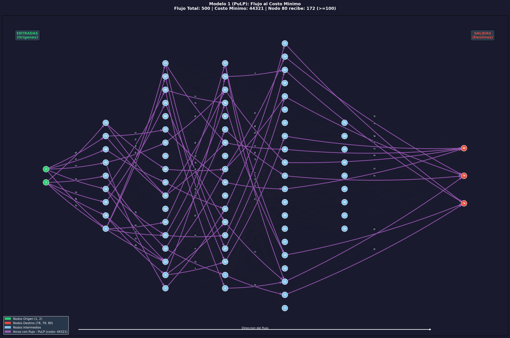

# Modelo 1 (PuLP): Flujo al Costo Minimo
**Metodologia: Programacion Matematica (PuLP / Programacion Lineal)**

## Descripcion

Variante del Modelo 1 usando **PuLP** (programacion lineal) en lugar de NetworkX.
Se formula como un **problema de programacion lineal (LP)** y se resuelve con el
solver **CBC** (Coin-or Branch and Cut).

## Formulacion LP

```
Minimizar: SUM(costo_ij * x_ij)  para todo arco (i,j)

Sujeto a:
  0 <= x_ij <= capacidad_ij         (limites de flujo)
  SUM(x_out) - SUM(x_in) = 0       (conservacion en nodos intermedios)
  Flujo total desde origenes = 500
  Flujo al nodo 80 >= 100
```

## Resultados

| Metrica | Valor |
|---|---|
| **Costo total minimo** | **44321** |
| Restriccion nodo 80 (>= 100) | **SI** |
| Arcos activos | 80 |
| **Tiempo de ejecucion** | **0.1322 segundos** |
| Solver | CBC (PuLP) |

### Flujo por Origen

| Nodo Origen | Flujo Enviado |
|---|---|
| Nodo 1 | 219 |
| Nodo 2 | 281 |

### Flujo por Destino

| Nodo Destino | Flujo Recibido | Porcentaje |
|---|---|---|
| Nodo 78 | 163 | 32.6% |
| Nodo 79 | 165 | 33.0% |
| Nodo 80 | 172 | 34.4% |

### Arcos Activos

| Origen | Destino | Flujo | Capacidad | Costo Unitario | Costo x Flujo |
|---|---|---|---|---|---|
| 1 | 37 | 43 | 43 | 35 | 1505 |
| 1 | 29 | 28 | 28 | 39 | 1092 |
| 1 | 75 | 47 | 47 | 9 | 423 |
| 1 | 18 | 42 | 42 | 41 | 1722 |
| 1 | 4 | 59 | 59 | 36 | 2124 |
| 2 | 31 | 83 | 83 | 42 | 3486 |
| 2 | 42 | 53 | 53 | 37 | 1961 |
| 2 | 68 | 23 | 23 | 19 | 437 |
| 2 | 73 | 54 | 54 | 7 | 378 |
| 2 | 4 | 68 | 100 | 41 | 2788 |
| 42 | 53 | 38 | 48 | 15 | 570 |
| 42 | 5 | 15 | 29 | 13 | 195 |
| 31 | 22 | 29 | 86 | 9 | 261 |
| 31 | 12 | 21 | 21 | 12 | 252 |
| 31 | 66 | 33 | 33 | 21 | 693 |
| 29 | 61 | 28 | 58 | 13 | 364 |
| 75 | 49 | 25 | 60 | 17 | 425 |
| 75 | 35 | 22 | 66 | 26 | 572 |
| 68 | 41 | 23 | 58 | 30 | 690 |
| 37 | 13 | 43 | 89 | 12 | 516 |
| 18 | 12 | 16 | 57 | 15 | 240 |
| 18 | 8 | 26 | 61 | 17 | 442 |
| 73 | 57 | 23 | 93 | 6 | 138 |
| 73 | 35 | 31 | 87 | 17 | 527 |
| 4 | 24 | 25 | 25 | 33 | 825 |
| 4 | 67 | 22 | 22 | 30 | 660 |
| 4 | 12 | 26 | 26 | 17 | 442 |
| 4 | 22 | 25 | 25 | 6 | 150 |
| 4 | 71 | 29 | 52 | 21 | 609 |
| 41 | 25 | 23 | 29 | 7 | 161 |
| 53 | 63 | 38 | 38 | 7 | 266 |
| 49 | 39 | 25 | 86 | 7 | 175 |
| 67 | 10 | 22 | 46 | 6 | 132 |
| 35 | 44 | 45 | 86 | 5 | 225 |
| 35 | 63 | 8 | 47 | 9 | 72 |
| 5 | 25 | 15 | 22 | 9 | 135 |
| 13 | 7 | 29 | 29 | 10 | 290 |
| 13 | 47 | 14 | 83 | 14 | 196 |
| 12 | 39 | 63 | 94 | 13 | 819 |
| 22 | 21 | 41 | 41 | 20 | 820 |
| 22 | 58 | 13 | 27 | 26 | 338 |
| 8 | 74 | 8 | 70 | 9 | 72 |
| 8 | 23 | 9 | 95 | 15 | 135 |
| 8 | 10 | 9 | 71 | 8 | 72 |
| 71 | 44 | 27 | 27 | 13 | 351 |
| 71 | 15 | 2 | 90 | 25 | 50 |
| 24 | 77 | 25 | 36 | 9 | 225 |
| 57 | 34 | 23 | 48 | 11 | 253 |
| 61 | 23 | 28 | 29 | 7 | 196 |
| 66 | 6 | 22 | 94 | 19 | 418 |
| 66 | 58 | 11 | 65 | 9 | 99 |
| 23 | 11 | 37 | 46 | 16 | 592 |
| 74 | 62 | 8 | 56 | 6 | 48 |
| 34 | 33 | 23 | 23 | 8 | 184 |
| 77 | 11 | 2 | 60 | 19 | 38 |
| 77 | 16 | 23 | 83 | 20 | 460 |
| 6 | 11 | 22 | 22 | 5 | 110 |
| 39 | 70 | 32 | 32 | 6 | 192 |
| 39 | 56 | 56 | 56 | 24 | 1344 |
| 7 | 9 | 29 | 53 | 6 | 174 |
| 63 | 38 | 46 | 75 | 10 | 460 |
| 25 | 72 | 38 | 69 | 8 | 304 |
| 47 | 36 | 14 | 87 | 16 | 224 |
| 44 | 46 | 72 | 83 | 10 | 720 |
| 10 | 50 | 31 | 34 | 5 | 155 |
| 15 | 56 | 2 | 95 | 23 | 46 |
| 21 | 62 | 41 | 82 | 8 | 328 |
| 58 | 16 | 24 | 45 | 19 | 456 |
| 72 | 78 | 38 | 79 | 23 | 874 |
| 11 | 79 | 61 | 61 | 5 | 305 |
| 50 | 80 | 31 | 60 | 34 | 1054 |
| 33 | 80 | 23 | 82 | 19 | 437 |
| 62 | 78 | 49 | 49 | 14 | 686 |
| 70 | 79 | 32 | 52 | 19 | 608 |
| 9 | 78 | 29 | 97 | 34 | 986 |
| 16 | 78 | 47 | 47 | 15 | 705 |
| 46 | 80 | 72 | 72 | 17 | 1224 |
| 36 | 79 | 14 | 90 | 20 | 280 |
| 38 | 80 | 46 | 46 | 14 | 644 |
| 56 | 79 | 58 | 91 | 12 | 696 |

## Grafica


