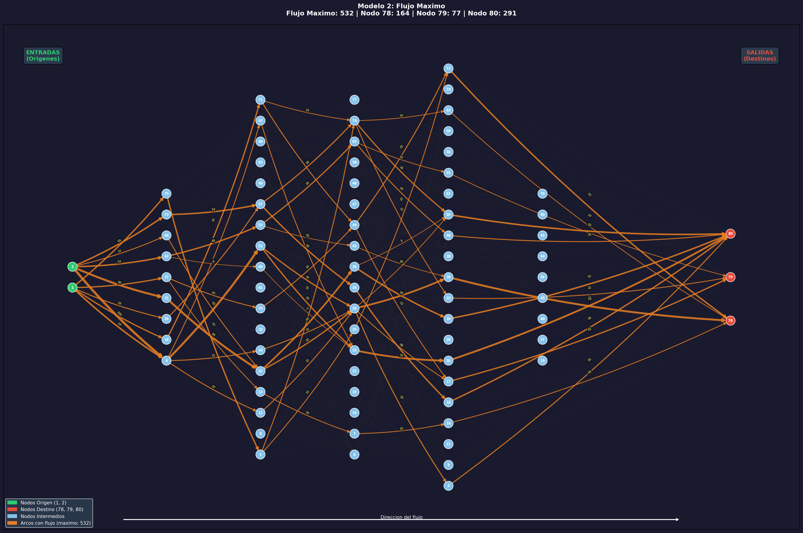

# Modelo 2: Flujo Maximo
**Metodologia: Algoritmica (NetworkX / NX)**

## Descripcion del Problema

Se busca determinar el **flujo maximo** que puede transportarse desde los nodos
origen (1, 2) hacia los nodos destino (78, 79, 80) a traves de la red, respetando
las **capacidades** de cada arco.

## Parametros del Modelo

| Parametro | Valor |
|---|---|
| Nodos origen | [1, 2] |
| Nodos destino | [78, 79, 80] |
| Capacidad "infinita" (super-arcos) | 10000 |

## Algoritmo Utilizado

Se utiliza **`nx.maximum_flow()`** de NetworkX, que implementa el algoritmo de
**Edmonds-Karp** (variante de Ford-Fulkerson con BFS).

### Modelado con super-nodos:
1. Se crea un **super-origen** (nodo 0) conectado a los nodos 1 y 2 con capacidad
   infinita (10000).
2. Se crea un **super-destino** (nodo 81) al que se conectan los nodos 78, 79 y 80
   con capacidad infinita.
3. El flujo maximo se calcula entre el super-origen y el super-destino.
4. Las capacidades infinitas aseguran que los super-arcos no limiten el flujo;
   los cuellos de botella reales estan en la red original.

## Funcionamiento del Codigo

```
cargar_datos()           -> Lee CSV con 391 arcos
construir_grafo()        -> Crea DiGraph con capacity, cost, distance
agregar_super_nodos()    -> Agrega nodos 0 y 81 con capacidad infinita
resolver_flujo_maximo()  -> Ejecuta maximum_flow() (Edmonds-Karp)
analizar_resultados()    -> Extrae metricas y cuellos de botella
generar_grafica()        -> PNG con layout izquierda(entrada) -> derecha(salida)
generar_readme()         -> Este archivo
```

## Resultados

### Resumen General

| Metrica | Valor |
|---|---|
| **Flujo maximo total** | **532** |
| Arcos activos | 73 |
| Arcos saturados (cuello de botella) | 29 |
| **Tiempo de ejecucion** | **0.0050 segundos** |

### Flujo por Origen

| Nodo Origen | Flujo Enviado |
|---|---|
| Nodo 1 | 219 |
| Nodo 2 | 313 |

### Flujo por Destino

| Nodo Destino | Flujo Recibido | Porcentaje |
|---|---|---|
| Nodo 78 | 164 | 30.8% |
| Nodo 79 | 77 | 14.5% |
| Nodo 80 | 291 | 54.7% |

### Arcos Saturados (Cuellos de Botella)

Estos arcos operan al 100% de su capacidad y limitan el flujo total de la red:

| Origen | Destino | Flujo | Capacidad |
|---|---|---|---|
| 1 | 37 | 43 | 43 |
| 1 | 29 | 28 | 28 |
| 1 | 75 | 47 | 47 |
| 1 | 18 | 42 | 42 |
| 1 | 4 | 59 | 59 |
| 37 | 35 | 24 | 24 |
| 4 | 24 | 25 | 25 |
| 4 | 67 | 22 | 22 |
| 4 | 51 | 87 | 87 |
| 2 | 31 | 83 | 83 |
| 2 | 42 | 53 | 53 |
| 2 | 68 | 23 | 23 |
| 2 | 73 | 54 | 54 |
| 2 | 4 | 100 | 100 |
| 42 | 53 | 48 | 48 |
| 53 | 63 | 38 | 38 |
| 5 | 25 | 22 | 22 |
| 22 | 26 | 43 | 43 |
| 51 | 26 | 42 | 42 |
| 71 | 44 | 27 | 27 |
| 57 | 34 | 48 | 48 |
| 26 | 36 | 69 | 69 |
| 44 | 17 | 21 | 21 |
| 63 | 46 | 26 | 26 |
| 39 | 30 | 55 | 55 |
| 74 | 50 | 38 | 38 |
| 74 | 33 | 22 | 22 |
| 50 | 80 | 60 | 60 |
| 3 | 80 | 30 | 30 |

### Todos los Arcos Activos

| Origen | Destino | Flujo | Capacidad | % Uso |
|---|---|---|---|---|
| 1 | 37 | 43 | 43 | 100.0% |
| 1 | 29 | 28 | 28 | 100.0% |
| 1 | 75 | 47 | 47 | 100.0% |
| 1 | 18 | 42 | 42 | 100.0% |
| 1 | 4 | 59 | 59 | 100.0% |
| 37 | 35 | 24 | 24 | 100.0% |
| 37 | 13 | 19 | 89 | 21.3% |
| 29 | 57 | 28 | 87 | 32.2% |
| 75 | 5 | 47 | 64 | 73.4% |
| 18 | 71 | 42 | 86 | 48.8% |
| 4 | 24 | 25 | 25 | 100.0% |
| 4 | 67 | 22 | 22 | 100.0% |
| 4 | 51 | 87 | 87 | 100.0% |
| 4 | 12 | 25 | 26 | 96.2% |
| 2 | 31 | 83 | 83 | 100.0% |
| 2 | 42 | 53 | 53 | 100.0% |
| 2 | 68 | 23 | 23 | 100.0% |
| 2 | 73 | 54 | 54 | 100.0% |
| 2 | 4 | 100 | 100 | 100.0% |
| 31 | 22 | 83 | 86 | 96.5% |
| 42 | 53 | 48 | 48 | 100.0% |
| 42 | 49 | 5 | 26 | 19.2% |
| 68 | 22 | 23 | 67 | 34.3% |
| 73 | 57 | 54 | 93 | 58.1% |
| 53 | 63 | 38 | 38 | 100.0% |
| 53 | 43 | 10 | 97 | 10.3% |
| 49 | 23 | 5 | 77 | 6.5% |
| 67 | 23 | 22 | 74 | 29.7% |
| 35 | 44 | 24 | 86 | 27.9% |
| 5 | 25 | 22 | 22 | 100.0% |
| 5 | 74 | 25 | 92 | 27.2% |
| 22 | 26 | 43 | 43 | 100.0% |
| 22 | 39 | 63 | 98 | 64.3% |
| 12 | 26 | 25 | 29 | 86.2% |
| 13 | 7 | 19 | 29 | 65.5% |
| 24 | 26 | 25 | 37 | 67.6% |
| 51 | 26 | 42 | 42 | 100.0% |
| 51 | 23 | 45 | 53 | 84.9% |
| 71 | 44 | 27 | 27 | 100.0% |
| 71 | 74 | 15 | 61 | 24.6% |
| 57 | 34 | 48 | 48 | 100.0% |
| 57 | 74 | 34 | 77 | 44.2% |
| 25 | 72 | 22 | 69 | 31.9% |
| 26 | 50 | 14 | 74 | 18.9% |
| 26 | 3 | 30 | 85 | 35.3% |
| 26 | 36 | 69 | 69 | 100.0% |
| 26 | 17 | 22 | 71 | 31.0% |
| 44 | 17 | 21 | 21 | 100.0% |
| 44 | 72 | 30 | 39 | 76.9% |
| 63 | 46 | 26 | 26 | 100.0% |
| 63 | 55 | 12 | 55 | 21.8% |
| 43 | 36 | 10 | 27 | 37.0% |
| 23 | 20 | 72 | 92 | 78.3% |
| 39 | 30 | 55 | 55 | 100.0% |
| 39 | 50 | 8 | 75 | 10.7% |
| 34 | 16 | 48 | 50 | 96.0% |
| 7 | 14 | 19 | 99 | 19.2% |
| 74 | 50 | 38 | 38 | 100.0% |
| 74 | 33 | 22 | 22 | 100.0% |
| 74 | 62 | 14 | 56 | 25.0% |
| 20 | 80 | 72 | 95 | 75.8% |
| 50 | 80 | 60 | 60 | 100.0% |
| 62 | 78 | 14 | 49 | 28.6% |
| 33 | 79 | 22 | 34 | 64.7% |
| 14 | 78 | 19 | 82 | 23.2% |
| 36 | 78 | 79 | 99 | 79.8% |
| 16 | 80 | 48 | 59 | 81.4% |
| 72 | 78 | 52 | 79 | 65.8% |
| 46 | 80 | 26 | 72 | 36.1% |
| 30 | 80 | 55 | 72 | 76.4% |
| 3 | 80 | 30 | 30 | 100.0% |
| 17 | 79 | 43 | 87 | 49.4% |
| 55 | 79 | 12 | 76 | 15.8% |

## Grafica

La grafica muestra el grafo con:
- **Izquierda**: Nodos origen (entradas) en verde
- **Derecha**: Nodos destino (salidas) en rojo
- **Centro**: Nodos intermedios en azul claro
- **Naranja**: Arcos con flujo > 0 (grosor proporcional al flujo)


