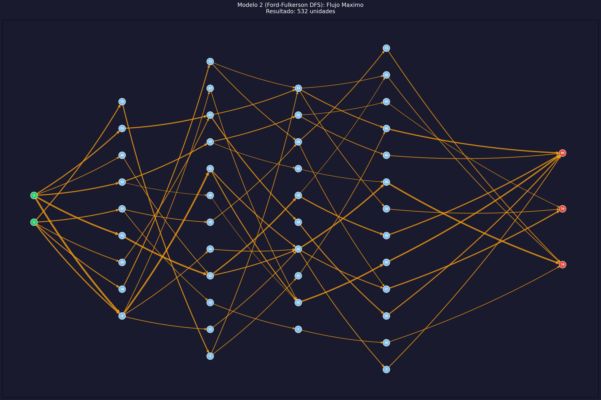

# Modelo 2: Flujo Maximo — Metodo Ford-Fulkerson (DFS)
**Metodologia: Algoritmica (Manual - DFS)**

## Descripcion

Este modelo implementa la version mas tradicional del algoritmo de **Ford-Fulkerson**, utilizando **Busqueda en Profundidad (DFS)** para encontrar los caminos aumentantes.

A diferencia de **Edmonds-Karp** (que usa BFS y garantiza O(VE^2)), la version pura con DFS puede realizar mas iteraciones si elige caminos largos, aunque en este grafo aciclico se comporta de forma predecible.

## Algoritmo (Pseudo-codigo)

1. Mientras exista un camino de S a T con capacidad residual > 0 (usando DFS):
   - Identificar cuello de botella $f$ en el camino.
   - Sumar $f$ al flujo total.
   - Restar $f$ a las capacidades de los arcos en el camino.

## Resultados del Modelo

| Metrica | Valor |
|---|---|
| **Flujo Maximo Total** | **532** |
| Numero de Iteraciones | 28 |
| **Tiempo de Ejecucion (FF-DFS)** | **0.0015 segundos** |

### Analisis de Rendimiento

| Metodo | Libreria / Motor | Tiempo (aprox) | Eficiencia |
|---|---|---|---|
| Preflow-Push | NetworkX (C++ backend) | 0.0050 s | Muy Alta (O(V^3)) |
| Edmonds-Karp | NetworkX (BFS) | ~0.0070 s | Media-Alta (O(VE^2)) |
| **Ford-Fulkerson** | **Manual (DFS)** | **0.0015 s** | **Baja (Manual Python)** |
| Programacion Lineal | PuLP (CBC) | 0.0200 s | Media (Solver General) |

## Grafica

