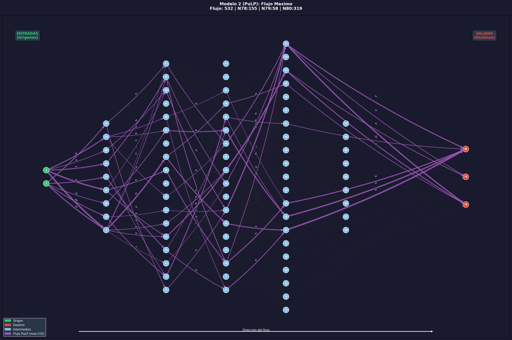

# Modelo 2 (PuLP): Flujo Maximo
**Metodologia: Programacion Matematica (PuLP / Programacion Lineal)**

## Descripcion
Variante usando **PuLP** (LP). Maximiza F sujeto a conservacion de flujo.

## Resultados

| Metrica | Valor |
|---|---|
| **Flujo maximo** | **532** |
| Arcos activos | 73 |
| Saturados | 31 |
| **Tiempo** | **0.0540 seg** |
| Solver | CBC |

### Flujo por Destino

| Nodo | Flujo | % |
|---|---|---|
| 78 | 155 | 29.1% |
| 79 | 58 | 10.9% |
| 80 | 319 | 60.0% |

### Saturados

| Origen | Destino | Flujo | Cap |
|---|---|---|---|
| 1 | 37 | 43 | 43 |
| 1 | 29 | 28 | 28 |
| 1 | 75 | 47 | 47 |
| 1 | 18 | 42 | 42 |
| 1 | 4 | 59 | 59 |
| 2 | 31 | 83 | 83 |
| 2 | 42 | 53 | 53 |
| 2 | 68 | 23 | 23 |
| 2 | 73 | 54 | 54 |
| 2 | 4 | 100 | 100 |
| 42 | 67 | 38 | 38 |
| 73 | 60 | 22 | 22 |
| 4 | 24 | 25 | 25 |
| 4 | 67 | 22 | 22 |
| 4 | 22 | 25 | 25 |
| 67 | 34 | 24 | 24 |
| 51 | 23 | 53 | 53 |
| 5 | 25 | 22 | 22 |
| 71 | 44 | 27 | 27 |
| 48 | 28 | 20 | 20 |
| 34 | 72 | 29 | 29 |
| 39 | 62 | 80 | 80 |
| 25 | 72 | 69 | 69 |
| 47 | 28 | 63 | 63 |
| 44 | 72 | 39 | 39 |
| 10 | 72 | 26 | 26 |
| 10 | 30 | 52 | 52 |
| 72 | 78 | 79 | 79 |
| 72 | 80 | 57 | 57 |
| 62 | 78 | 49 | 49 |
| 20 | 80 | 95 | 95 |

## Grafica

