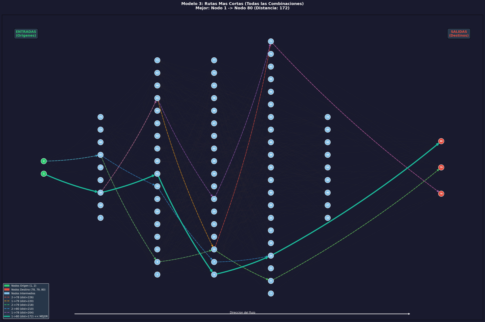
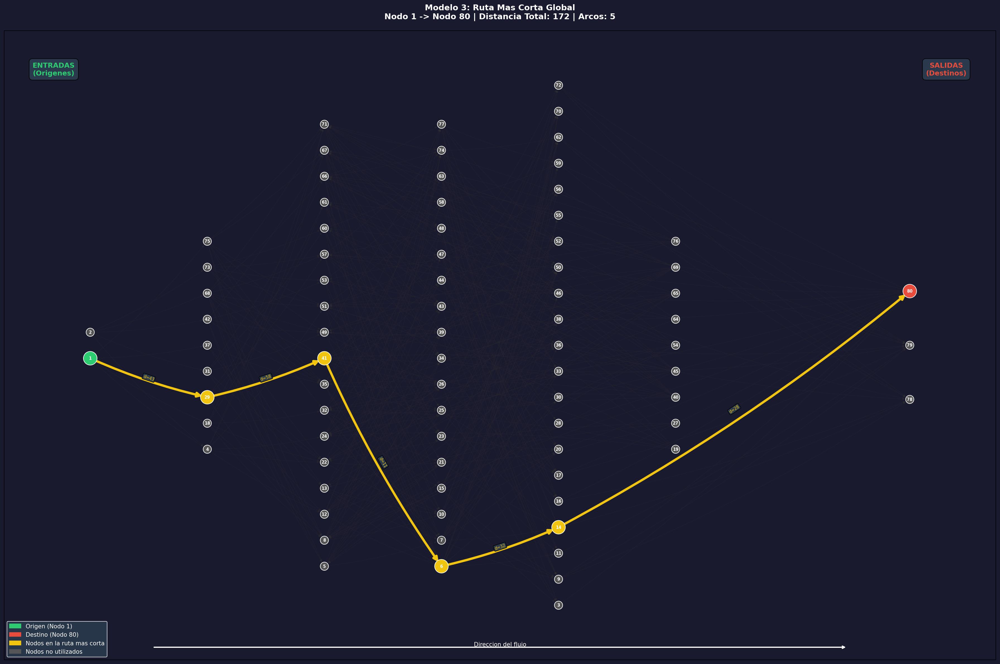

# Modelo 3: Ruta Mas Corta
**Metodologia: Algoritmica (NetworkX / NX)**

## Descripcion del Problema

Se busca encontrar la **ruta mas corta** (en terminos de distancia) entre los
nodos origen (1, 2) y los nodos destino (78, 79, 80).

Se evaluan las **6 combinaciones** posibles: {1,2} x {78,79,80}.

## Parametros del Modelo

| Parametro | Valor |
|---|---|
| Nodos origen | [1, 2] |
| Nodos destino | [78, 79, 80] |
| Peso de arcos | Distancia |
| Algoritmo | Dijkstra |

## Algoritmo Utilizado

Se utiliza **`nx.shortest_path()`** y **`nx.shortest_path_length()`** de NetworkX,
que implementan el **algoritmo de Dijkstra** para grafos con pesos no negativos.

### Funcionamiento de Dijkstra:
1. Comienza en el nodo origen con distancia = 0.
2. Explora los vecinos actualizando la distancia minima conocida.
3. Siempre expande el nodo no visitado con menor distancia acumulada.
4. Termina cuando llega al nodo destino o explora todos los nodos alcanzables.
5. Complejidad: O((V + E) log V) con cola de prioridad.

## Funcionamiento del Codigo

```
cargar_datos()            -> Lee CSV con 391 arcos
construir_grafo()         -> Crea DiGraph con weight=Distancia
calcular_todas_rutas()    -> Dijkstra para cada par (origen, destino)
identificar_mejor_ruta()  -> Selecciona la ruta con menor distancia
generar_grafica_todas()   -> PNG con las 6 rutas en colores diferentes
generar_grafica_mejor()   -> PNG enfocado en la mejor ruta
generar_readme()          -> Este archivo
```

## Resultados

### Todas las Combinaciones (ordenadas por distancia)

| # | Origen | Destino | Distancia | N Arcos | Ruta |
|---|---|---|---|---|---|
| 1 | 1 | 80 | 172 | 5 | 1 -> 29 -> 41 -> 6 -> 14 -> 80 **<< MEJOR** |
| 2 | 1 | 78 | 204 | 5 | 1 -> 29 -> 61 -> 25 -> 72 -> 78 |
| 3 | 2 | 80 | 210 | 5 | 2 -> 42 -> 35 -> 7 -> 14 -> 80 |
| 4 | 2 | 79 | 218 | 5 | 2 -> 42 -> 8 -> 10 -> 9 -> 79 |
| 5 | 1 | 79 | 220 | 5 | 1 -> 29 -> 61 -> 10 -> 9 -> 79 |
| 6 | 2 | 78 | 226 | 5 | 2 -> 42 -> 8 -> 10 -> 72 -> 78 |

### Mejor Ruta Global

| Metrica | Valor |
|---|---|
| **Origen** | **Nodo 1** |
| **Destino** | **Nodo 80** |
| **Distancia total** | **172** |
| **Numero de arcos** | **5** |
| **Ruta** | **1 -> 29 -> 41 -> 6 -> 14 -> 80** |
| **Tiempo de ejecucion** | **0.0039 segundos** |

### Detalle Arco por Arco de la Mejor Ruta

| Arco | Distancia | Costo | Capacidad | Dist. Acumulada |
|---|---|---|---|---|
| 1 -> 29 | 43 | 39 | 28 | 43 |
| 29 -> 41 | 58 | 43 | 91 | 101 |
| 41 -> 6 | 11 | 50 | 94 | 112 |
| 6 -> 14 | 32 | 27 | 69 | 144 |
| 14 -> 80 | 28 | 41 | 25 | 172 |

## Graficas

### Todas las Rutas
Muestra las 6 rutas en colores diferentes. La mejor ruta aparece con
trazo continuo y grueso. Las demas con trazo discontinuo y fino.



### Mejor Ruta
Enfoca la mejor ruta con etiquetas de distancia en cada arco.
Los nodos de la ruta aparecen resaltados en amarillo.



---

**Disposicion del grafo:**
- **Izquierda**: Nodos origen (entradas) en verde
- **Derecha**: Nodos destino (salidas) en rojo
- **Centro**: Nodos intermedios en azul claro (o amarillo si estan en la ruta)
