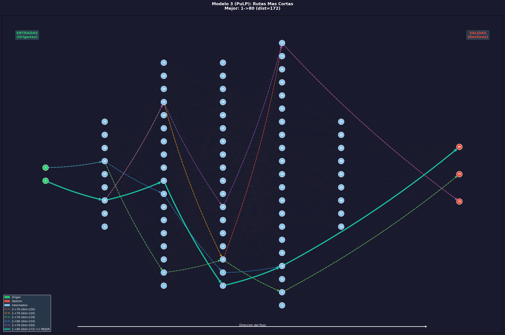
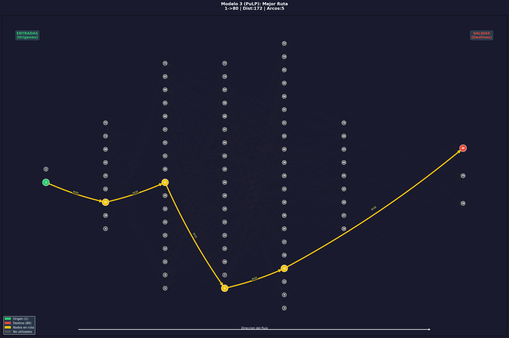

# Modelo 3 (PuLP): Ruta Mas Corta
**Metodologia: Programacion Matematica (PuLP / Programacion Lineal Binaria)**

## Descripcion
Variante usando **PuLP** (LP con variables binarias). Formula cada ruta como:
**min SUM(dist_ij * x_ij)** con flujo unitario y x_ij binarias.

## Resultados

| # | Origen | Destino | Distancia | Arcos |
|---|---|---|---|---|
| 1 | 1 | 80 | 172 | 5 **MEJOR** |
| 2 | 1 | 78 | 204 | 5 |
| 3 | 2 | 80 | 210 | 5 |
| 4 | 2 | 79 | 218 | 5 |
| 5 | 1 | 79 | 220 | 5 |
| 6 | 2 | 78 | 226 | 5 |

| Metrica | Valor |
|---|---|
| **Mejor ruta** | **1 -> 80** |
| **Distancia** | **172** |
| **Ruta** | **1 -> 29 -> 41 -> 6 -> 14 -> 80** |
| **Tiempo total** | **0.3217 seg** |
| Solver | CBC (PuLP) |

## Graficas

